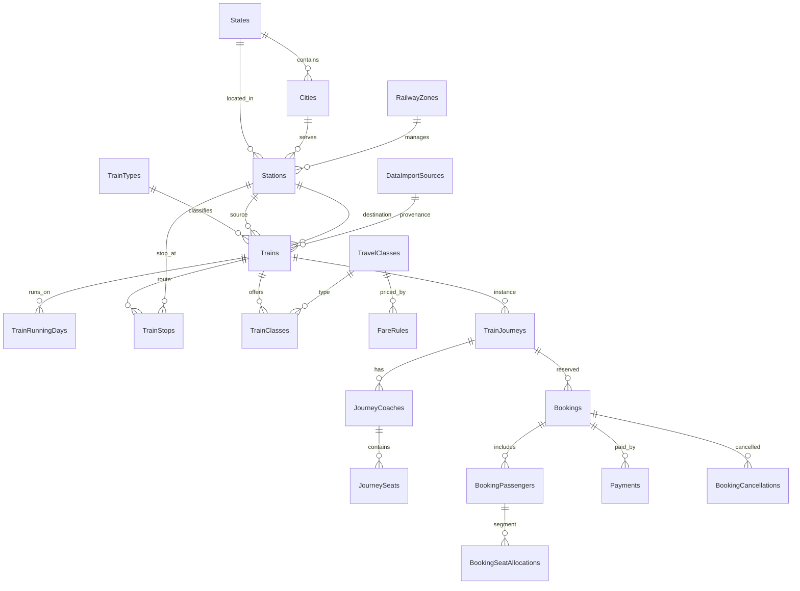

# Railway Data Architecture

## Stack (actual implementation)

This repository uses **Node.js + Express + raw SQL Server** (via `msnodesqlv8`), **not** ASP.NET Core / EF Core. Master-data architecture follows the same normalized design principles described in the product spec, adapted to the existing repository patterns.

| Layer | Technology |
|-------|------------|
| API | Express (`backend/server.js`) |
| Database | Microsoft SQL Server / LocalDB |
| Schema | Idempotent SQL scripts (`database/schema.sql`, `database/schema-railway-master.sql`) |
| ORM | None — repositories use parameterized SQL |
| Import | `database/import/RailwayDataImporter.js` |

## Data classification

### Category A — Master / static data
Stations, trains, routes, stops, running days, train classes. Imported from **legitimate open datasets** or **labeled development CSVs** in `data/railway/processed/`.

### Category B — Reservation simulation (development)
Fares (`FareRules`, `fareSimulationService`), seat maps, availability, RAC/WL, bookings, PNR. Clearly **not** official Indian Railways data.

### Category C — Real-time (future)
Live location, delays, official availability. Interface only (`FutureExternalAvailabilityProvider`); not implemented.

## Entity relationship (Mermaid)



## Core tables

| Table | Purpose |
|-------|---------|
| `States`, `Cities`, `RailwayZones` | Geographic / organizational master |
| `Stations` | Unique station codes, normalized names, FK to state/city/zone |
| `TrainTypes`, `Trains` | Train identity; source/destination station FKs |
| `TrainRunningDays` | Normalized day-of-week (1=Mon … 7=Sun) |
| `TrainStops` | **Source of truth for route order** — stop sequence, times, day offsets |
| `TravelClasses`, `TrainClasses` | Class availability per train |
| `Quotas` | GN, TQ, LD, SS (extensible) |
| `DataImportSources` | Provenance registry |
| `FareRules`, `TrainSegmentFares` | Simulated vs future exact fares |
| `TrainJourneys`, `JourneyCoaches`, `JourneySeats` | Per-date inventory scaffold |
| `BookingSeatAllocations` | Segment-interval seat reuse |

## Train-between-stations search

**Incorrect:** match only `Trains.sourceStationId` and `Trains.destinationStationId`.

**Correct:** join `TrainStops` twice on the same `trainId`:

```sql
FROM Trains t
JOIN TrainStops fs ON fs.trainId = t.id AND fs.stationId = @fromId
JOIN TrainStops ts ON ts.trainId = t.id AND ts.stationId = @toId
WHERE fs.stopOrder < ts.stopOrder
  AND t.isActive = 1
```

Implemented in `backend/services/trainSearchService.js`.

### Running day / multi-day logic

When boarding at an intermediate stop:

```
SourceDepartureDate = BoardingDate - FromStop.departureDayOffset
```

Then check `SourceDepartureDate.DayOfWeek` against `TrainRunningDays`.

Implemented in `backend/services/runningDayService.js`.

### Duration and distance

```
Duration = (to.arrivalDayOffset * 1440 + to.arrivalMinutes)
         - (from.departureDayOffset * 1440 + from.departureMinutes)

DistanceKm = to.distanceFromSourceKm - from.distanceFromSourceKm
```

## Fare strategy

1. If authorized exact fare exists in `TrainSegmentFares` → use it.
2. Else → `fareSimulationService` (distance × class rate + charges).

All simulated fares are flagged `fareSource: development_simulation`.

## Inventory strategy (segment-based)

Seat reuse across non-overlapping route segments uses half-open intervals `[fromStopSequence, toStopSequence)`.

```javascript
// backend/utils/segmentOverlap.js
intervalsOverlap(1, 3, 3, 5) === false  // allowed reuse
intervalsOverlap(1, 3, 2, 4) === true     // conflict
```

`BookingSeatAllocations` stores `fromStopSequence` / `toStopSequence` per passenger allocation.

## APIs

| Endpoint | Description |
|----------|-------------|
| `GET /api/stations/search?q=` | Station autocomplete (ranked) |
| `GET /api/trains/search?from=&to=&date=` | Train-between-stations search |
| `GET /api/trains/autocomplete?q=` | Train number/name search |
| `GET /api/trains/:id/route` | Ordered stops with day offsets |
| `GET /api/trains/:id` | Train summary |
| `GET /api/fares/estimate` | Development fare estimate |
| `GET /api/availability/check` | Development availability |
| `GET /api/admin/data-import/status` | Import provenance + counts |
| `GET /api/admin/trains?page=&pageSize=` | Paginated admin trains |
| `GET /api/admin/stations?page=&pageSize=` | Paginated admin stations |

## Schedule versioning (future)

Current design stores schedules in `TrainStops` without version columns. For production refresh cycles, add:

- `TrainSchedules (trainId, validFrom, validTo, version)`
- `TrainScheduleStops` or version FK on `TrainStops`

Document migration path before enabling live schedule swaps.

## Staging tables (future)

For nationwide imports, optional staging tables (`StagingStations`, `StagingTrains`, `StagingTrainStops`) allow validate-then-merge. Current development scale uses direct upsert in `RailwayDataImporter`.

## What remains simulated

- Fares (unless `TrainSegmentFares` populated from authorized source)
- Seat availability / RAC / waitlist
- Tatkal rules (partial — eligibility helper exists)
- Coach rake composition

## Future authorized integration

- Official fare API / dataset → `TrainSegmentFares`
- Official availability → `FutureExternalAvailabilityProvider`
- Live train running → new `ITrainRunningProvider` adapter (Category C)
- Real PNR lookup → external provider; local PNR remains app bookings only
